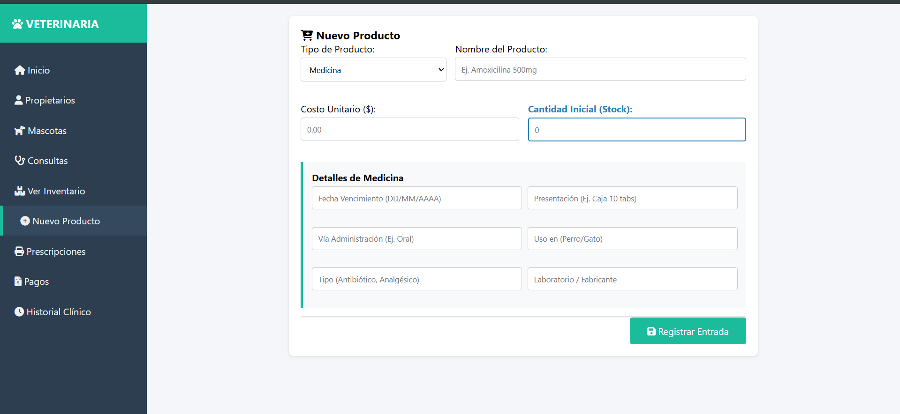
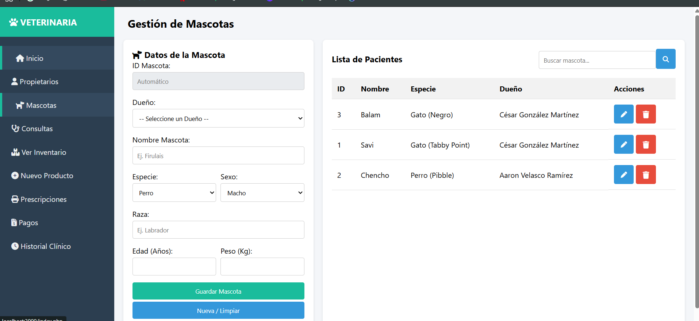
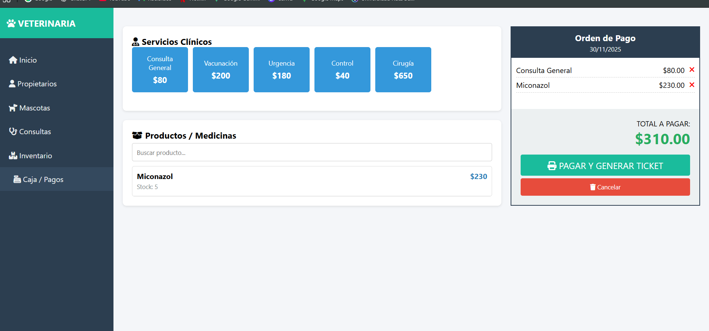

# 🐾 Sistema de Gestión Veterinaria

Sistema integral web para la administración de clínicas veterinarias. Permite gestionar pacientes, historiales médicos, inventario y punto de venta con emisión de tickets y recetas.


## Características Principales

El sistema cuenta con los siguientes módulos:

* **Gestión de Pacientes y Dueños:** Registro completo de propietarios y mascotas con asociación relacional.
* **Consultas Médicas:** Registro de diagnósticos, tratamientos y actualización automática del peso del paciente.
* **Historial Clínico:** Visualización tipo "Línea de tiempo" de todas las consultas de una mascota.
* **Inventario Inteligente:** Gestión de productos divididos en categorías (Medicinas, Comida, Accesorios) con atributos específicos para cada uno.
* **Control de Stock:** Descuento automático de inventario al realizar una venta.
* **Prescripciones PDF:** Generación de recetas médicas listas para imprimir.
* **Punto de Venta (POS):** Carrito de compras para productos y servicios con generación de Ticket de venta en PDF.

## 🛠️ Tecnologías Utilizadas

* **Lenguaje:** PHP 8.2
* **Base de Datos:** MySQL
* **Frontend:** HTML5, CSS3 (Diseño Responsive), JavaScript (Vanilla).
* **Estilos:** CSS personalizado con Flexbox y FontAwesome para iconos.
* **Entorno:** Docker & Docker Compose (Opcional).

---

## 🚀 Instalación y Despliegue

Puedes ejecutar este proyecto de dos formas: usando **Docker** (recomendado) o manualmente con **XAMPP**.

### Opción A: Usando Docker (Rápido y Fácil) 🐳

Si tienes Docker instalado, no necesitas configurar nada más. El contenedor configura PHP, Apache y la Base de Datos automáticamente.

1.  Clona el repositorio:
    ```bash
    git clone [https://github.com/Cglez18/Veterinaria_web.git](https://github.com/Cglez18/Veterinaria_web.git)
    cd Veterinaria_web
    ```

2.  Levanta los contenedores:
    ```bash
    docker-compose up -d --build
    ```

3.  Accede al sistema:
    * Abre tu navegador en: `http://localhost:8080`
    * *Nota: La base de datos se importa automáticamente al iniciar.*

### Opción B: Instalación Manual (XAMPP) 🛠️

1.  **Base de Datos:**
    * Abre phpMyAdmin.
    * Crea una base de datos llamada `Veterinaria`.
    * Importa el archivo `init.sql` (o `SCRIPT veterinaria.sql`) que está en la carpeta raíz.

2.  **Configuración:**
    * Ve a la carpeta `config/` y edita el archivo `db.php`.
    * Asegúrate de que las credenciales coincidan con tu XAMPP (usualmente usuario `root` y contraseña vacía).

    ```php
    // Ejemplo para XAMPP
    $host = "localhost";
    $username = "root";
    $password = "";
    ```

3.  **Ejecución:**
    * Mueve la carpeta del proyecto a `C:/xampp/htdocs/`.
    * Abre tu navegador en `http://localhost/Veterinaria_web`.

---

## 📸 Capturas de Pantalla


| Inventario | Mascotas| Pagos |
|-----------|-----------------|
|  |  |   |

## 📄 Estructura de la Base de Datos

El sistema utiliza un modelo relacional con las siguientes tablas principales:
* `Propietario` -> `Mascota` -> `Consulta`
* `Producto` (Padre) -> `Medicina`, `Comida`, `Accesorios` (Hijas)

